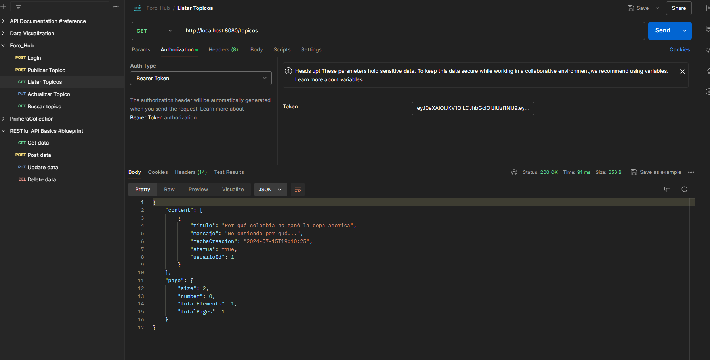

# Foro-Hub

API REST utilizando Spring. Permite a los usuarios realizar operaciones CRUD (Crear, Leer, Actualizar, Eliminar) sobre tópicos, respuestas y usuarios. La funcionalidad se centra en la gestión de tópicos, permitiendo la creación de nuevos tópicos, la visualización de todos los tópicos o un tópico específico, la actualización y eliminación de tópicos.

## Dependencias:

- Spring Data JPA
- PostgreSQL Driver
- Spring Security
- Spring Web
- Auth0 JWT
- Flyway Migration
- Validation
- Lombok